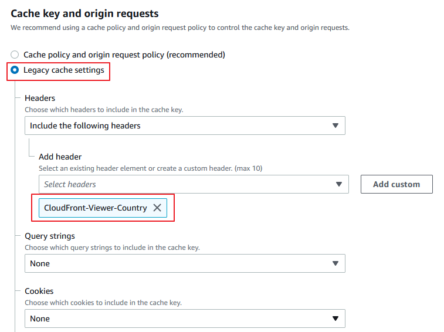
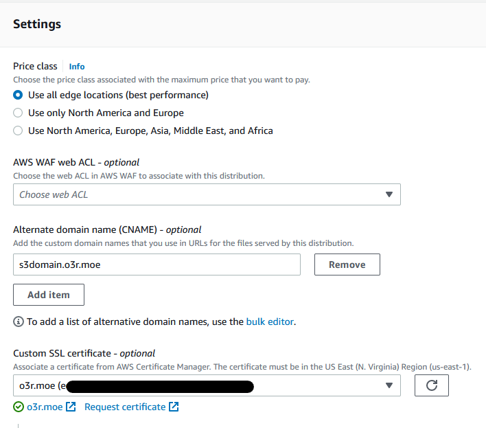
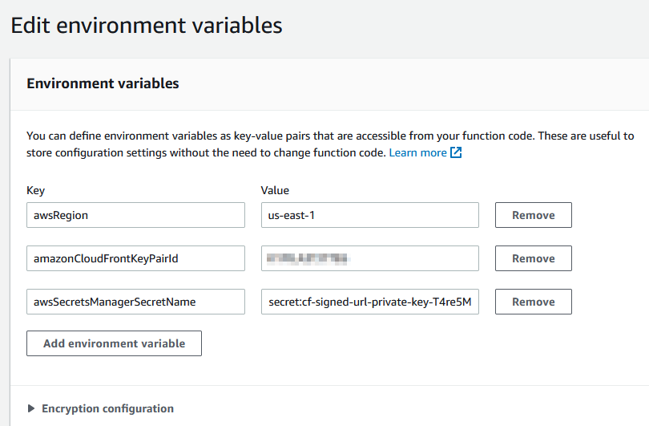
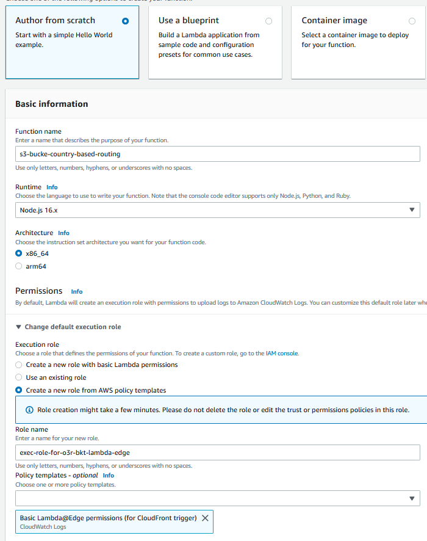
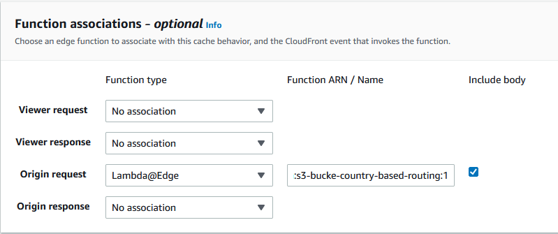
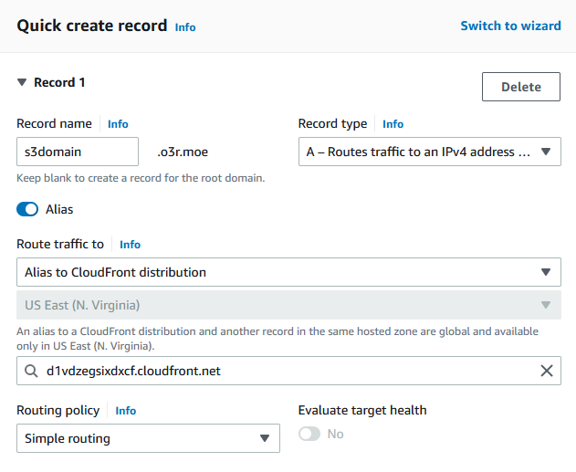

## 前言
最近遇到客戶有上傳至 S3 的應用，因為客戶希望使用同一個域名，依據用戶所在國家，自動路由到最接近的 region 的 S3 bucket 進行上傳，以增進用戶上傳速度體驗。
由於 S3 的機制，有一些限制導致無法直接使用 Rotue53 加上 Geolocation routing，實際做起來會比想像中複雜。
而且客戶因為在中國也有業務，也有使用中國的 S3 bucket，因此**無法直接使用 S3 multiregion access point**。
本文主要紀錄實現步驟，以滿足這項需求。


## 建立 S3 bucket
首先建立兩個 S3 bucket，這邊以 us-east-1 以及 ap-east-1 (香港) 作為示範，因為香港的 S3 剛好不支援 multiregion access point。

- bucket name: o3r-us
  - region: US East (N. Virginia) us-east-1
- bucket name: o3r-hk
  - region: Asia Pacific (Hong Kong) ap-east-1

接著各上傳一個 index.html 做為測試，其實稍後會使用 CloudFront signed URL 進行上傳。

## 建立 Cloudfront distribution
建立一個 Cloudfront distribution，Origin domain 可以隨便選一個 bucket，因為接下來我們會透過 Lambda@Edge 依據用戶地理位置選擇適當的 S3 bucket 作為 origin。
CloudFront 設定:
- Origin
  - Origin domain: o3r-us.s3.us-east-1.amazonaws.com
  - Origin path: 空
  - Origin access: Legacy access identities 

點選 Legacy access identities 下的 Create OAI，建立完成後在 Origin access identity 選擇剛才創建的 OAI，Bucket policy 下選擇 Yes, update the bucket policy。

- Default cache behavior
  - Viewer protocol policy: HTTP and HTTPS 或 Redirect HTTP to HTTPS 皆可，建議選擇後者
  - Allowed HTTP methods: GET, HEAD, OPTIONS, PUT, POST, PATCH, DELETE
  - Cache key and origin requests
    - 為了簡單化步驟，選擇 Legacy cache settings
    - Headers 選擇 Include the following headers，勾選 **CloudFront-Viewer-Country**



- 拉到下方的 Settings 區塊
  - Alternate domain name (CNAME) 選擇 Add item，輸入您想提供用戶存取 S3 的域名，這邊以 `s3domain.o3r.moe` 做示範
  - Custom SSL certificate 有在 ACM 申請的話，也一起加入。



### 添加另一個 S3 bucket 作為第二個 S3 Origin
在 CloudFront 的 Origin 設定中，新增一個 Origin。
- Origin domain: o3r-hk.s3.ap-east-1.amazonaws.com
- Origin path: 空
- Origin access: Legacy access identities (設定步驟請參考上述第一個 S3 origin 的設定，並選擇相同的 OAI)

### 修改兩個 S3 bucket 權限，允許 `s3:PutObject` 行為
前往 S3 頁面，編輯兩個 bucket 的 policy，添加 `s3:PutObject` 如下：

```json
{
	"Version": "2008-10-17",
	"Id": "PolicyForCloudFrontPrivateContent",
	"Statement": [
		{
			"Sid": "1",
			"Effect": "Allow",
			"Principal": {
				"AWS": "arn:aws:iam::cloudfront:user/CloudFront Origin Access Identity E34XXXXXXX9QA"
			},
			"Action": ["s3:GetObject","s3:PutObject"],
			"Resource": "arn:aws:s3:::bucket-name/*"
		}
	]
}
```

## 透過 CloudFront Signel URL 讓只有允許的用戶存取 S3

### 建立 Cloudfront Key Pair 提供 CloudFront signed URL 使用

CloudFront signed URL 是使用我們自行生成的 RSA 金鑰對，public key 會放在 CloudFront Key Group 中，private key 會放在 AWS Secrets Manager 中，我們會透過撰寫 Lambda 來獲得 Secrets Manager 中的 private key 產生 CloudFront Signed URL，用戶獲得這個 URL 便可透過 CloudFront 上傳或下載背後的 S3。

首先在 Linux 執行以下指令:
```sh
openssl genrsa -out cf_private_key.pem 2048
openssl rsa -pubout -in cf_private_key.pem -out cf_public_key.pem
```

接著複製 `cf_public_key.pem` 的內容 (請連同 BEGIN PUBLIC KEY 一起複製)
```
$ cat cf_public_key.pem
-----BEGIN PUBLIC KEY-----
MIIBIjANBgkqhkiG9w0BAQEFAAOCAQ8AMIIBCgKCAQEA8hOjjASNcMJYPgoLTb89
(中間省略)
fxTZtxWf73lV5wcWbnBiQfYn7Up+glu05IzOK43D4vVjtAgYEg2XlpzoMKybkOCL
CQIDAQAB
-----END PUBLIC KEY-----
```

前往 [CloudFront Public Key 頁面](https://us-east-1.console.aws.amazon.com/cloudfront/v3/home?region=us-east-1#/publickey)，點選 Create publie key，將以上內容貼在下方 Key 中。
請記下 Public Key 的 ID (例如 K2XXXXXXXXXXXX)，稍後建立 Lambda 會使用到。
創建完成後，前往 [Key Groups](https://us-east-1.console.aws.amazon.com/cloudfront/v3/home?region=us-east-1#/keygrouplist)，選擇 Create Key Group，Public Keys 選擇剛才創建的 public key。

### 將 private key 上傳至 Secrets Manager


1. 前往 [AWS Secrets Manager](https://us-west-2.console.aws.amazon.com/secretsmanager).
2. 選擇一個區域 (us-east-1)
3. 選擇 Store a new secret.
4. Select secret type 選擇 Other type of secrets.
5. Specify the key/value pairs to be stored in this secret 選擇 Plaintext.
6. 將之前產生的 `cf_private_key.pem` 內容貼上
7. 接著下一步，為密鑰命名
8. 其餘設定先不管他，我們直接下一步直到點選 Store
9. 記下 Secret 的名稱 以及 ARN，接下來會用到。如果沒看到東西，請重整頁面

### 建立生成 CloudFront Signed URL 的 Lambda

這是第一個 Lambda function，請參考以下步驟:

1. 在 [Lambda 主控台](https://us-east-1.console.aws.amazon.com/lambda/home?region=us-east-1#/functions)選擇和剛才 AWS Secrets Manager 相同的區域
2. 選擇 Create function.
3. 選擇 Author from scratch.
4. 為 Function 命名
5. Runtime 為 Node.js 12.x.
6. 在 Change default execution role 下方選擇 Create a new role with basic Lambda permissions.
7. 選擇 Create Function，並將以下程式碼覆蓋貼上:

```js
const AWS = require('aws-sdk');
const secretsManager = new AWS.SecretsManager({region: process.env.awsRegion});
const crypto = require('crypto');
const replacementChars = {'+':'-', '=':'_', '/':'~'}
const getKeyFromSecretsManager = () => {
  return new Promise((resolve, reject) => {
    secretsManager.getSecretValue({SecretId: process.env.awsSecretsManagerSecretName}, (err, data) => {
    if (err) {
      console.log ("Get Secret Error", err);
      return reject(err)
    }
    console.log("Private key retrieved");
    return resolve(data.SecretString);
    });
  });
}

exports.handler = async (event, data, callback) => {
    let expiration = new Date(event.queryStringParameters.expiration)/1000|0;
    let baseUrl = event.queryStringParameters.baseUrl;
  let cannedPolicy = {
    "Statement":[
      {
        "Resource": baseUrl,
        "Condition":{
          "DateLessThan":{
            "AWS:EpochTime": expiration
          }
        }
      }
    ]
  };
  cannedPolicy = JSON.stringify(cannedPolicy);

  let encodedPolicy = new Buffer.from(cannedPolicy).toString("base64");
  encodedPolicy = encodedPolicy.replace(/[+=/]/g, m => replacementChars[m]);

  const signer = crypto.createSign('RSA-SHA1');
  signer.update(cannedPolicy);
  let signedPolicy = signer.sign(await getKeyFromSecretsManager(), 'base64');
  signedPolicy = signedPolicy.replace(/[+=/]/g, m => replacementChars[m]);
  
  const paramDelimiter = (baseUrl.indexOf('?') === -1) ? '?' : '&';
  const cfSignedUrl = `${baseUrl}${paramDelimiter}Expires=${expiration}&Signature=${signedPolicy}&Key-Pair-Id=${process.env.amazonCloudFrontKeyPairId}`;

  callback(null,cfSignedUrl);
}
```

8. 在 Lambda environment variables 中新增以下環境變數 :

  - awsRegion: "us-east-1" // 區域名稱
  - amazonCloudFrontKeyPairId: "K2XXXXXXXXXXXX" // CloudFront 上的 Public Key ID
  - awsSecretsManagerSecretName: "your_secret_name" // secrets manager 的密鑰名稱



9. 儲存 (File > Save) 並 deploy
10. 修改剛才建立 Lambda 過程中建立的 IAM Role policy，新增以下的內容讓 Lambda 有權限讀取 secrets manager 中的密鑰，請記得將 ARN 替換為您剛才建立的 secrets manager 密鑰 ARN。

```json
{
    "Effect": "Allow",
    "Action": "secretsmanager:GetSecretValue",
    "Resource": "arn:aws:secretsmanager:us-east-1:8xxxxxxxxxx6:secret​:your_secret_name"
}
```
11. 接著在 Lambda 進入 Configuration 頁籤，選擇 Function URL，點選 create function URL，Auth type 選擇 NONE。您會獲得一個 Function URL。
12. 使用以下指令測試:

```sh
curl https://7xegi64psvsqbxr3dgljq6hlve0vnoki.lambda-url.us-east-1.on.aws/?baseUrl=https%3A%2F%2Fs3domain.o3r.moe%2Findex.html&expiration=12%2F12%2F2022%2012%3A30%3A30%20EST
```

這樣用戶/APP 可以透過這個 URL 發送請求來獲得 CloudFront 的 signed URL，讓用戶只能透過 APP 獲得連接 CloudFront 的權限。
我們透過兩個 query string 提供資訊給 Lambda function URL，`baseUrl` 是允許用戶訪問的 URL 路徑，`expiration` 則是指定 signed URL 的時效，query string 格式如下:

- 名稱:`baseUrl`，值: https://xxxx.cloudfront.net/path1/.../pathN
- 名稱:`expiration`，值: 例如 12/12/2022 12:30:30 EST，只要 JavaScript `Date.parse()` 可以辨識的格式都可以，詳細可參考 [Date.parse() 的說明](https://developer.mozilla.org/en-US/docs/Web/JavaScript/Reference/Global_Objects/Date/parse)。

**注意: 以上 query string 的"值"必須經過 URL encode 的字串處理。**

## 建立 Lambda@Edge function
Lambda@Edge 就是一透過 Lambda function 的程式碼客製化 CloudFront 的行為，並佈署到全球的 CloudFront 節點上實現功能。

這會是第二個 Lambda function，
請注意，Lambda 必須使用 us-east-1 區域，才能佈署到 Cloudfront 的 Lambda@Edge。

參考 [3] 新增 Lambda function，runtime 選擇 Node.js 16.x，Change default execution role 選擇 Create a new role from AWS policy templates，在 Policy templates 選擇 Basic Lambda@Edge permissions (for CloudFront trigger)。
名稱命名為 s3-bucket-country-based-routing。



建立完成後，將以下程式碼覆蓋到 Lambda 程式碼編輯視窗內。

```js
'use strict';

exports.handler = (event, context, callback) => {
    const request = event.Records[0].cf.request;
    const headers = request.headers;
    const origin = request.origin;

    //Setup the two different origins
    const usBucket = "o3r-us.s3.us-east-1.amazonaws.com";
    const hkBucket = "o3r-hk.s3.ap-east-1.amazonaws.com";


    if (headers['cloudfront-viewer-country']) {
        for (let i = 0; i < headers['cloudfront-viewer-country'].length; i++) {
            if (headers['cloudfront-viewer-country'][i].value == 'US') {
                headers['host'] = [{key: 'host', value: usBucket}];
                origin.s3.domainName = usBucket;
                origin.s3.region = 'us-east-1';
                break;
            } else if (headers['cloudfront-viewer-country'][i].value == 'CN') {
                headers['host'] = [{key: 'host', value: hkBucket}];
                origin.s3.domainName = hkBucket;
                origin.s3.region = 'ap-east-1';
                break;
            }
        }
    } 

    callback(null, request);
};
```

接著點選 Test 旁的 Deploy 佈署新版本，並切換到 Versions 頁籤，點選 deploy new version。
接著頁面會導向到 Lambda 版本頁面，請複製 ARN，ARN 是有版本區別的，請注意結尾的數字就是版本。例如: `arn:aws:lambda:us-east-1:123456789012:function:s3-bucket-country-based-routing:1`

接著回到 Cloudfront 頁面，在 Bahavior 編輯 Default(*) behavior，在最下方 Function associations 的 Origin request 選擇 Lambda@edge，並貼上剛才複製的 ARN。



## Route53
在 Route53 新增一筆紀錄，對應到剛才新建的 Cloudfront。
如果 CloudFront 和 Route53 域名是位於同一個帳戶，可以使用 A record type 加上開啟 Alias，並且輸入 CloudFront 的域名。



## 測試結果
我在北京 AWS 的 EC2 透過 curl 測試，CloudFront 確實按照請求來源國家，路由到指定對應的 bucket:

測試下載檔案:
```sh
curl https://s3domain.o3r.moe/index.html\?Expires\=1670866230\&Signature\=iv7CdZyY3P9rYk....90xijA__\&Key-Pair-Id\=KXXXXXXXX6
```
輸出為一個我之前放在香港 bucket 的識別用網頁:
```
<h1> Bucket in HK </h1>
```

測試上傳檔案 (PUT 請求):
```sh
curl -sv --upload-file ‘test.txt’ ‘https://s3domain.o3r.moe/path/test?Expires=1670866230&Signature=DO-THpe.....zrOQ__&Key-Pair-Id=KXXXXXXX6’
```
到對應的 bucket 檢查，確實檔案上傳至 CloudFront signed URL 指定的路徑。

另外在 us-east-1 測試路由效果:
測試下載檔案:
```sh
curl https://s3domain.o3r.moe/index.html\?Expires\=1670866230\&Signature\=iv7CdZyY3P9rYk....90xijA__\&Key-Pair-Id\=KXXXXXXXX6
```
輸出為一個我之前放在 us-east-1 bucket 的識別用網頁:
```
<h1> Bucket in US </h1>
```
測試上傳檔案，檔案上傳到 us-east-1 bucket。

## 結語
建置過程較複雜，因為服務上有許多限制，導致必須 coding 並使用 Lambda@Edge，加上 CloudFront Signed URL 導致架構變得複雜。
以下是一些 Q&A 以及限制的說明：

#### Q: 不能透過 Route 53 Geolocation Routing 實現嗎?
A: 想得太簡單，依據 [RFC 7230](https://www.rfc-editor.org/rfc/rfc7230#section-5.4) 規定:
> A client **MUST** send a Host header field in all HTTP/1.1 request messages

所以 client 會依據 Route 53 的 domain 作為 Host header，然而 S3 有一個限制，如果要使用 Route53 + S3，bucket 名稱必須就是 domain name。
例如: Route53 `example.com` CNAME --> S3 bucket `example.com.s3.amazonaws.com`。
S3 是依據 client 發送的 Host header 來判斷請求要路由至哪個 bucket，因為不同 bucket 會共用相同的 S3 伺服器(i.e. 共用 IP pool)，因此 S3 也必須透過這個方式在多租戶環境下進行區別。
所以不可能建立第二個相同名稱的 bucket，這是 s3 的限制。

#### Q: S3 multiregion access point 呢?

A: 客戶情境是有些 bucket 在不支援 multiregion access point 的 region 中。

#### Q: 那 Route 53 Geolocation Routing 加上一層 CloudFront 再串 S3 呢?

A: CloudFront 自己沒有 Geolocation Routing 的功能，照這樣變成要使用兩個 CloudFront 並提供給 Route53 兩個 Geolocation Routing 紀錄使用。
但是 CloudFront 也是透過 Host header 判斷路由至哪個 distribution，所以最後問題會和 Route53 + 純 S3 一樣不可行。

## 參考
- [1] [Dynamically Route Viewer Requests to Any Origin Using Lambda@Edge](https://aws.amazon.com/blogs/networking-and-content-delivery/dynamically-route-viewer-req)
- [2] [Authenticating Requests: Using Query Parameters (AWS Signature Version 4)](https://docs.aws.amazon.com/AmazonS3/latest/API/sigv4-query-string-auth.html)
- [3] [Create your function](https://docs.aws.amazon.com/AmazonCloudFront/latest/DeveloperGuide/lambda-edge-how-it-works-tutorial.html#lambda-edge-how-it-works-tutorial-create-function)
- [4] [Example: Amazon CloudFront Signed URLs using Lambda and Secrets Manager](https://github.com/aws-samples/amazon-cloudfront-signed-urls-using-lambda-secretsmanager)